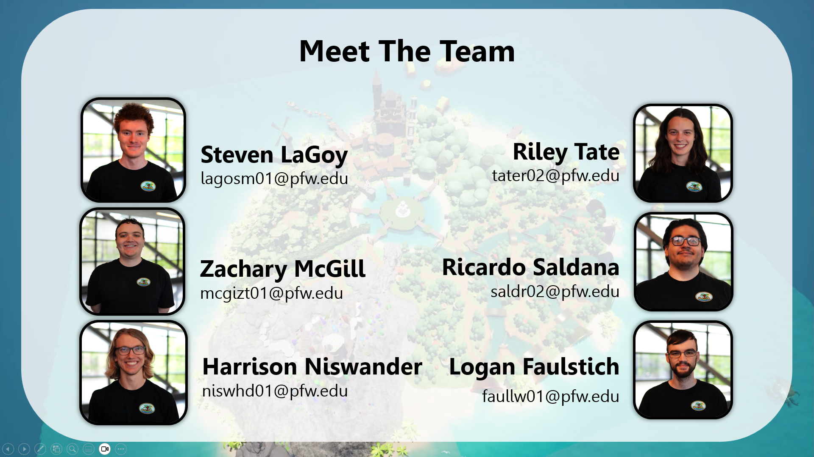
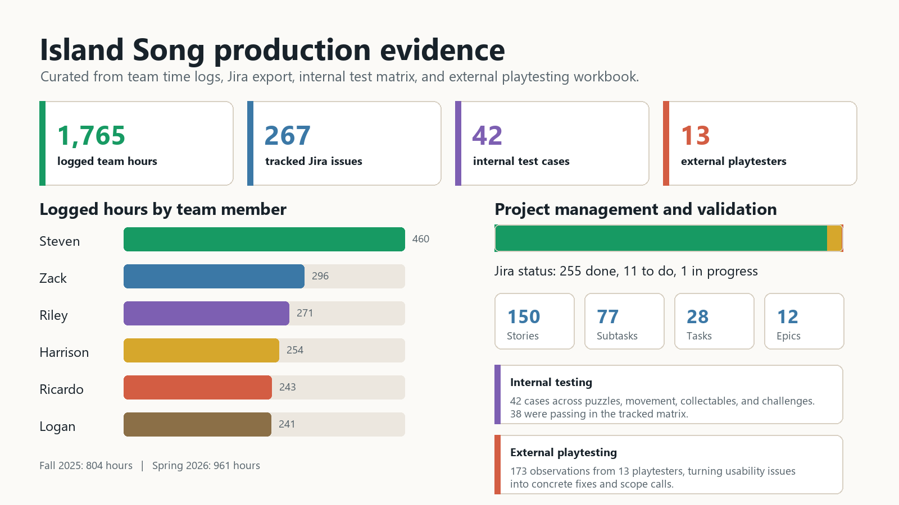
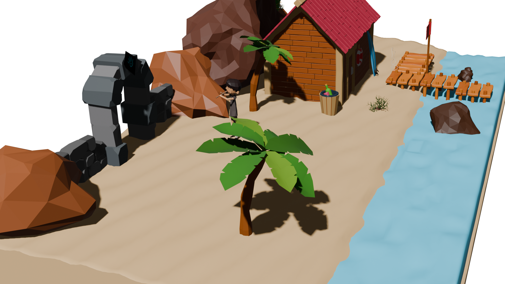
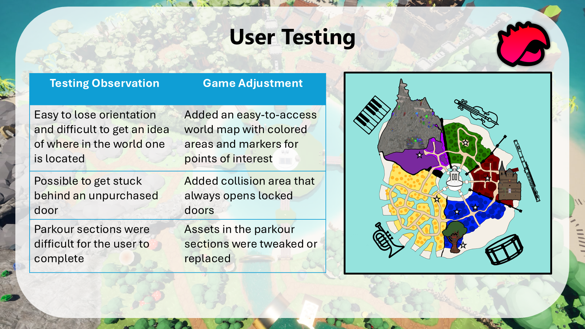

<h1 align="center">Island Song</h1>

  <strong>An Unreal Engine 5 puzzle-adventure capstone game about restoring music, color, and life to a sleeping island.</strong>

  <strong>Crustacean Works</strong> | Purdue University Fort Wayne Senior Capstone | 2025-2026

  

<video src="media/trailers/island-song-cinematic-trailer-readme.mp4" poster="media/trailers/trailer-poster.jpg" controls width="100%" title="Island Song cinematic trailer"></video>

## Snapshot

<table>
  <tr>
    <th>Category</th>
    <th>Details</th>
  </tr>
  <tr>
    <td><strong>Recognition</strong></td>
    <td>Recognized as <strong>PFW's best capstone project</strong></td>
  </tr>
  <tr>
    <td><strong>Time period</strong></td>
    <td>2025-2026, 32-week two-semester PFW senior capstone</td>
  </tr>
  <tr>
    <td><strong>Scale</strong></td>
    <td>1,700+ logged team hours across engineering, design, art, sound, testing, and production</td>
  </tr>
  <tr>
    <td><strong>Engine</strong></td>
    <td>Unreal Engine 5, Blueprint-heavy gameplay systems</td>
  </tr>
  <tr>
    <td><strong>My role</strong></td>
    <td>Project Manager and Technical Lead</td>
  </tr>
  <tr>
    <td><strong>Public build</strong></td>
    <td>Windows installer served through a project website backed by Google Cloud CI/CD</td>
  </tr>
</table>

## Why This Repo Exists

The production game lived in Perforce because the real project contained large Unreal Engine binaries, Blueprint assets, paid/third-party content, and nearly 100 GB of supporting material. This GitHub repository is the public portfolio version: a curated showcase built for recruiters and hiring managers who want to understand the project, my technical ownership, and the scale of the team effort without cloning a massive game depot.

## Team

Island Song was created by **Crustacean Works** for the Purdue University Fort Wayne Department of Computer Science capstone sequence.

**Steven LaGoy** - Team Lead  
**Zachary McGill** - Project Manager, Technical Lead  

## What I Owned

**Technical leadership and project management.** I helped coordinate a 6-person graduate capstone team, planned sprints, managed scope, and kept the project moving from early concept through final presentation and playable release.

**Perforce infrastructure.** I preserved Perforce as the right version-control path for Unreal after evaluating more expensive managed and cloud-hosted options, then designed and maintained the self-hosted setup under network, hardware, and team-experience constraints.

**Unreal gameplay systems.** I contributed to Blueprint-driven game logic, world partitioning, input standards, optimization work, bug fixing, and the color restoration mechanic that tied the game's central theme to player progress.

**Distribution.** I created the Windows installer path and supported the website workflow used to distribute the playable game.

## Technical Contributions

| Area | What mattered |
| --- | --- |
| [Color restoration system](docs/color-restoration-system.md) | Reusable restoration scenes radiating from 3D points, with animated radius behavior and spatial bounding. |
| [Perforce infrastructure](docs/perforce-infrastructure.md) | Self-hosted P4/P4V workflow for large Unreal assets, secure remote access, recovery automation, and team onboarding. |
| [Technical leadership](docs/technical-leadership.md) | Sprint planning, architecture decisions, development workflow, optimization support, and release readiness. |
| [Distribution pipeline](docs/distribution.md) | Installer and public website workflow for getting the playable build to players and reviewers. |
| [Project scale](docs/project-scale.md) | Timeline, logged hours, tools, testing, final deliverables, and team-wide production scope. |

## Production Evidence

The public repository includes selected project artifacts that show how the team planned, built, tested, presented, and delivered the game. The original SharePoint archive was much larger; this repo keeps the pieces that are most useful to understand the work without turning GitHub into a raw file dump.

- [Project management files](project-management/) - style guide, team policy document, early version-control cost analysis, Jira backlog export, internal test matrix, external playtesting log, and feedback analysis.
- [Internal documentation](internal-documentation/) - team-facing documentation for color mechanics, player systems, UI, world/map, music, settings, and puzzle systems.
- [Reports](reports/) - milestone reports from preliminary planning through the Q4 final report.
- [Presentation powerpoints](presentation%20powerpoints/) - selected milestone decks, including the compressed final presentation.

## Game Scope

Island Song is a free-to-play puzzle adventure game with a low-poly art style and an original soundtrack. Players explore the Island of Song as Sebastian, solving music- and sound-based puzzles to bring color back to a world that has fallen asleep.

The final project included:

- A standalone playable Windows build.
- Music-driven puzzle areas themed around instrument families.
- Color restoration mechanics connected to player progress.
- Menus, tutorial flow, save/load, NPC dialogue, cutscenes, collectables, and unlockable doors.
- Internal testing plus external alpha playtesting with 13 participants.
- Final reports, presentations, design docs, time logs, and a polished final package.

## User Testing

The team converted playtesting observations into concrete product changes, including map markers, collision fixes, and puzzle/challenge tuning.

## Playable Build

The public Windows installer was distributed through a minimal project website at [crustacean.works](https://crustacean.works).

<video src="media/install/island-song-installation-process-readme.mp4" controls width="100%" title="Island Song installation process"></video>

## Repository Guide

**Technical summaries**

- [Technical leadership](docs/technical-leadership.md) - leadership, architecture, delivery responsibilities, and constraints.
- [Perforce infrastructure](docs/perforce-infrastructure.md) - version-control decision-making, self-hosting, secure access, recovery, and P4V onboarding.
- [Color restoration system](docs/color-restoration-system.md) - the reusable Unreal color-restoration mechanic.
- [Distribution pipeline](docs/distribution.md) - installer, website, public download, and CI/CD summary.
- [Project scale](docs/project-scale.md) - timeline, logged hours, tools, testing, and deliverables.

**Curated artifacts**

- [Project management](project-management/) - selected planning, testing, backlog, feedback, and process artifacts.
- [Internal documentation](internal-documentation/) - team-facing design and system documentation.
- [Reports](reports/) - milestone reports.
- [Presentation powerpoints](presentation%20powerpoints/) - polished course presentation decks.